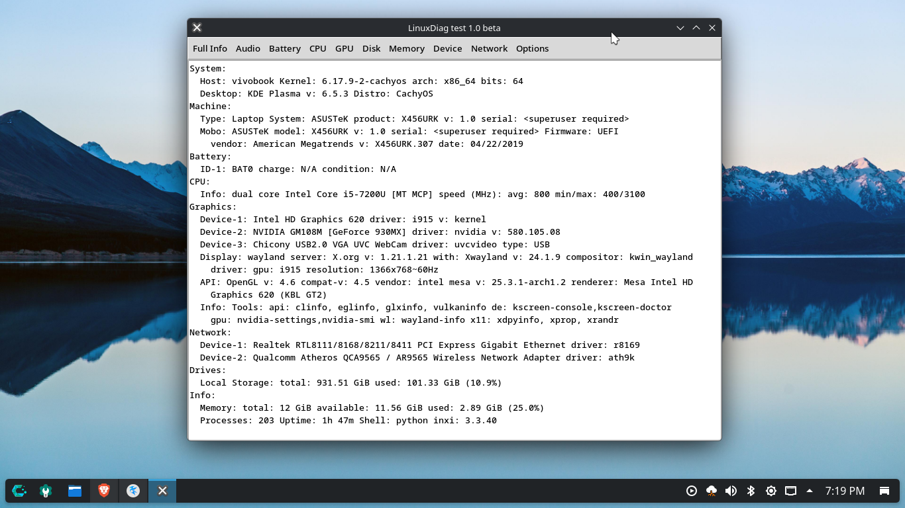
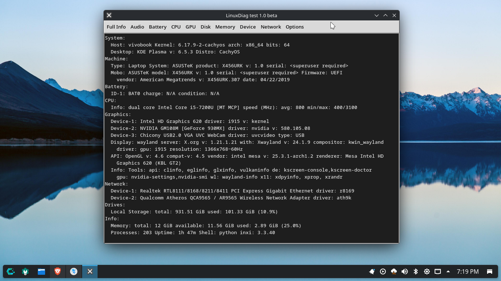

# LinuxDiag_test_v1
Linux system information GUI app using inxi command, build with Python + Tkinter. Test for learning purpose.

## Requirements
Before running this file you need tkinter and inxi installed.
### Ubuntu/Debian based
`sudo apt install python3-tk`
### Fedora/RHEL based
`sudo dnf install python3-tkinter`
### CachyOS/Arch based
`sudo pacman -S tk`

## Running test directly
`python /your/path/LinuxDiag_v1.py`

## Features
*Menu for every information.
*Light and Dark theme.
*Options menu for help and about.
*Simple Information from separated inxi commands.

##Screenshots

